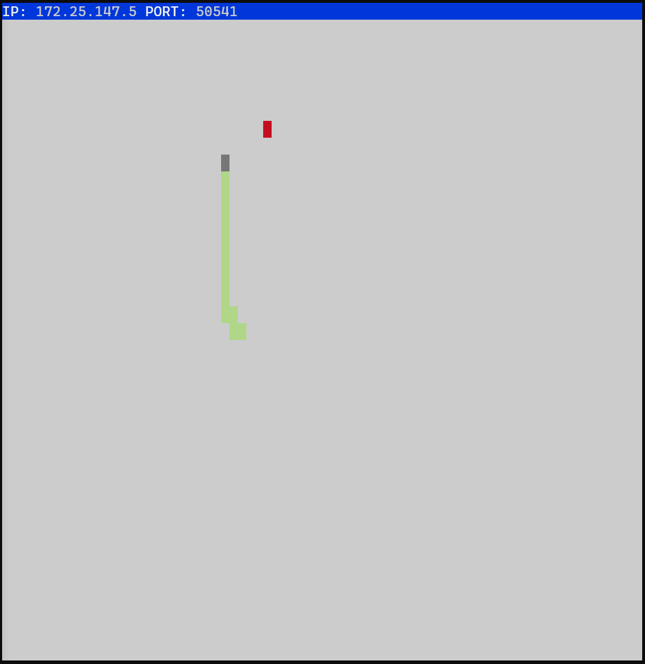

# Snake Client Project

Snake Game is a classic and popular arcade-style game that originated in the late 1970s. The game is simple yet addictive, and it has been adapted and played on various platforms throughout the years. In the Snake Game, players control a snake that moves around a grid or playing field. The objective is to guide the snake to eat food items (often represented by small dots or icons) that randomly appear on the screen. The goal is to grow it to become as big as possible without bumping into the side walls, or bumping into itself, upon which it dies.

This is simply a multiplayer take on the genre.

Before you can run this client, you will need to be running the server side which you can download and install from here. 
https://github.com/lighthouse-labs/snek-multiplayer

## Final Product

## Getting Started

- Follow steps inside the snek server repo to run the server side
- Run the development snake client using the `node play.js` command.